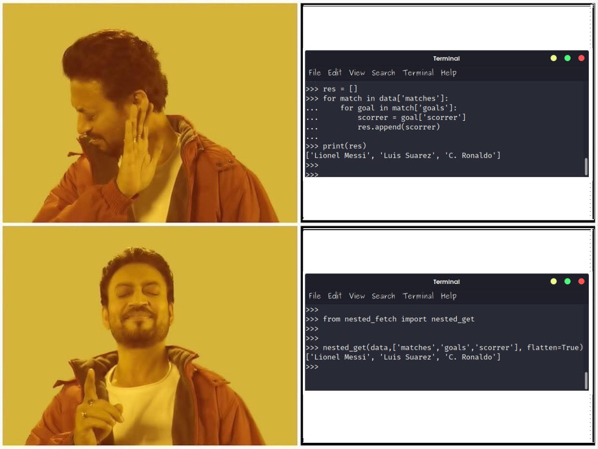

# ℕ𝕖𝕤𝕥𝕖𝕕𝔽𝕖𝕥𝕔𝕙
  

## Overview
**NestedFetch** provides syntactic sugar 🍬 to deal with nested python dictionaries 🐍.
You can `get` `set` `update`, `flatten`  values from deeply nested dictionaries with a more concise, easier and a more *KeyError*, *IndexError* free way 😌.  

